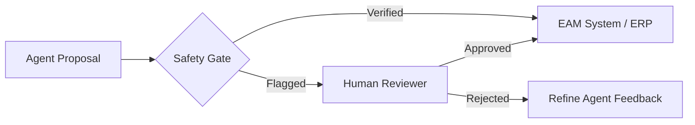

# Patterns: Agentic AI Orchestration in the Enterprise

**Context:** Moving beyond simple "Chatbots" to autonomous agents that can query technical manuals, analyze sensor telemetry, and propose maintenance interventions.

---

## 1. The "Analyst-Librarian-Strategist" Pattern

This multi-agent pattern ensures high accuracy and reduces LLM hallucinations in high-stakes environment (EAM/IoT).

### Agent A: The Analyst (Triage)
*   **Input:** Raw sensor alerts or technician notes.
*   **Role:** Extracts intent and creates a "Search Query" for the Knowledge Base.

### Agent B: The Librarian (RAG Specialist)
*   **Input:** Search Query.
*   **Action:** Performs Semantic Search against Vector DB (Technical Manuals, Historical Work Orders).
*   **Output:** Curated, relevant excerpts with source citations.

### Agent C: The Strategist (Synthesizer)
*   **Input:** Triage Data + Librarian Excerpts.
*   **Action:** Generates a "Draft Intervention Plan" including suggested tools, safety steps, and estimated time.

---

## 2. The "Safety Rail" Human-in-the-Loop Pattern

Autonomous agents must not be allowed to execute "Write" actions on critical infrastructure without verification.

## 3. Technical Implementation Standards
*   **Vector Database Choice**: Scoped by tenant to ensure data residency/compliance.
*   **Prompt Governance**: Centralized repository of "System Prompts" to ensure consistency across the enterprise.
*   **Evaluation (Eval) Framework**: Measuring "Faithfulness" (Did it stick to the manual?) and "Answer Relevance".

---
*Created by Gaurav Sharma — Solutions Architect Frameworks*
